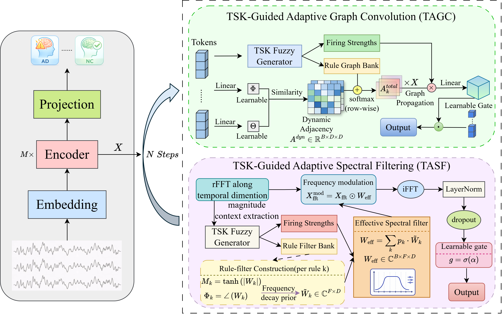

# TGSformer: A TSK-Guided Graph-Spectral Transformer for Interpretable EEG-based Alzheimer's Disease Classification

This repository contains the official implementation of **TGSformer**, a **Takagi--Sugeno--Kang (TSK)-guided Graph-Spectral Transformer** for interpretable electroencephalogram (EEG)-based Alzheimer's disease (AD) classification.

TGSformer embeds TSK fuzzy rules into the encoder layers, where rule activations directly participate in intermediate representation learning. The model jointly captures temporal dependencies, latent graph relations, and frequency-domain dynamics from EEG signals.

## Highlights

* **TSK-guided representation learning**
  TSK rules are embedded inside the encoder instead of being used only as a final fuzzy classifier.

* **TSK-Guided Adaptive Graph Convolution (TAGC)**
  TAGC integrates sample-specific dynamic graphs with learnable rule graph templates to model latent feature relations.

* **TSK-Guided Adaptive Spectral Filtering (TASF)**
  TASF dynamically aggregates rule-conditioned complex spectral filters according to the spectral context of each EEG sample.

* **Rule-constrained graph-spectral collaborative learning**
  Rule confidence and rule balance constraints improve the clarity, diversity, and stability of TSK rule learning.

* **Interpretable EEG classification**
  The model supports gradient-based saliency visualization and class-wise TSK rule activation analysis.

## Method Overview

Given an EEG segment, TGSformer first maps the input into token representations. These tokens are then processed by stacked encoder layers. Each encoder layer contains two complementary TSK-guided branches:

1. **TAGC** models adaptive latent graph relations.
2. **TASF** performs sample-specific spectral filtering.

The two branches are recurrently refined and fused inside the encoder. During training, auxiliary TSK rule constraints are introduced to encourage confident sample-level rule activation and balanced batch-level rule usage.

## Datasets

The experiments are conducted on three EEG-based AD classification settings:

| Dataset  | Task                             | Classes       |
| -------- | -------------------------------- | ------------- |
| ADFTD    | Three-class classification       | AD / FTD / NC |
| ADFTD-BI | Binary classification from ADFTD | AD / NC       |
| APAVA    | Binary classification            | AD / NC       |

All experiments follow a **cross-subject** evaluation protocol. EEG segments from the same subject appear only in one of the training, validation, or test sets.
